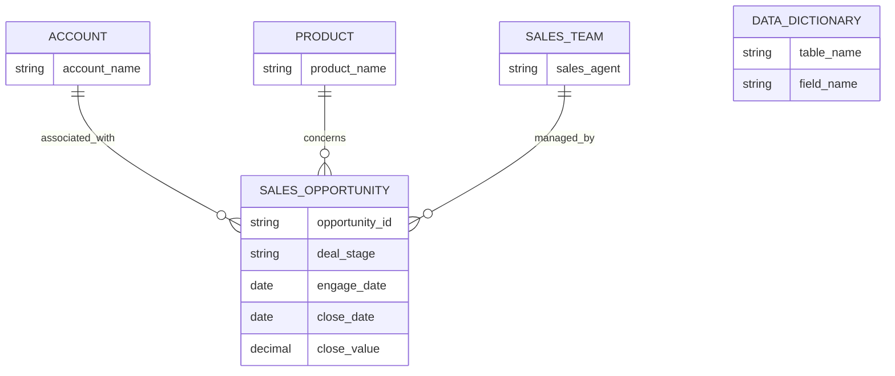
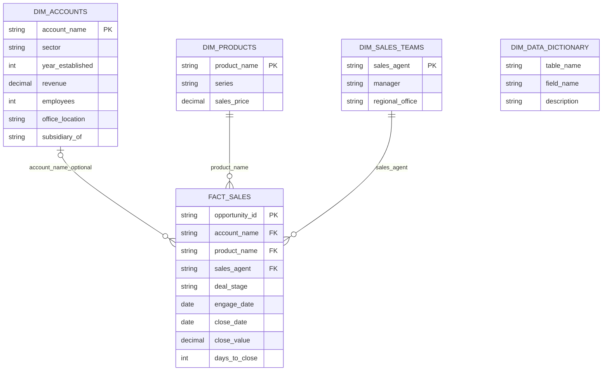
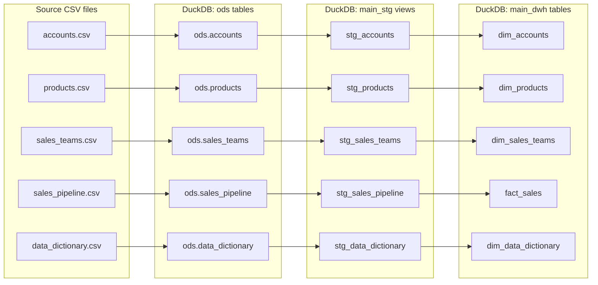

# CRM Sales Data Model

## Scope and grain

The warehouse models CRM sales opportunities. The central fact has one row per
`opportunity_id`. Account, product, and sales-agent details describe the
opportunity. The data dictionary is a reference dimension describing source
fields; it is not joined to individual sales rows.

## Conceptual schema

The data-dictionary relationship is descriptive only: dictionary records
document source columns and do not have a row-level foreign key to an
opportunity.

## Logical schema

Relationships below use business/natural keys from the source data. They
describe the analytical model; dbt does not add database-enforced foreign-key
constraints.

`FACT_SALES.account_name` is nullable because some open opportunities have no
account assigned. `close_date`, `close_value`, and consequently
`days_to_close` can also be null for opportunities that have not closed.

## Physical schema

The physical database is DuckDB at `dbt_project/dev.duckdb`.

`ods` tables are loaded from CSV by Airflow. dbt creates staging views in
`main_stg` and mart tables in `main_dwh`. The `main_` prefix is added by dbt's
default schema naming behavior. CSV source types are inferred by DuckDB during
loading; the columns above describe their intended logical types, not explicit
database constraints.

| Physical relation | Type | Purpose |
|---|---|---|
| `ods.accounts` | Table | Raw account records |
| `ods.data_dictionary` | Table | Source-field descriptions |
| `ods.products` | Table | Raw product catalog |
| `ods.sales_pipeline` | Table | One row per source opportunity |
| `ods.sales_teams` | Table | Sales-agent and reporting details |
| `main_stg.stg_accounts` | View | Cleaned account attributes |
| `main_stg.stg_data_dictionary` | View | Standardized dictionary fields |
| `main_stg.stg_products` | View | Standardized product attributes |
| `main_stg.stg_sales_pipeline` | View | Standardized opportunity attributes |
| `main_stg.stg_sales_teams` | View | Standardized sales-team attributes |
| `main_dwh.dim_accounts` | Table | Account dimension |
| `main_dwh.dim_data_dictionary` | Table | Data dictionary dimension |
| `main_dwh.dim_products` | Table | Product dimension |
| `main_dwh.dim_sales_teams` | Table | Sales-team dimension |
| `main_dwh.fact_sales` | Table | Opportunity-level sales fact |

The current dbt models retain natural keys in the fact and dimension models;
they do not generate surrogate keys or enforce physical foreign keys. The
physical flow diagram shows model lineage, not database-enforced constraints.

## Data quality

dbt tests enforce non-null and uniqueness rules for the opportunity ID and
selected dimension business keys, and non-null rules for required staging
attributes. `fact_sales.account_name` is intentionally not tested as
non-null because the source contains open opportunities without an assigned
account.
