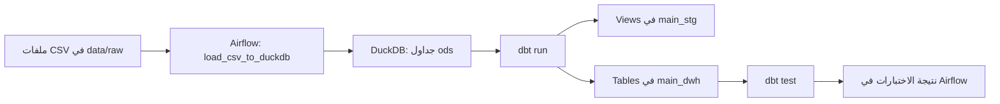

# توثيق مشروع CRM Sales ETL

## 1. نبذة عن المشروع

ينفّذ المشروع خط ETL لبيانات إدارة علاقات العملاء والمبيعات باستخدام:

- **Apache Airflow** لجدولة المهام وترتيب تنفيذها ومتابعة حالتها.
- **DuckDB** لتخزين البيانات محليًا في قاعدة ملفات.
- **dbt** لتحويل بيانات المصدر إلى نماذج مرحلية وجداول تحليلية واختبار جودتها.
- **Astro CLI وDocker** لتشغيل Airflow محليًا.

يحمّل الخط ملفات CSV إلى مخطط `ods`، ثم يبني dbt نماذج `staging` و`marts`،
ويشغّل اختبارات البيانات. تصميم المخططات المفاهيمي والمنطقي والفيزيائي موضح
في [DATA_MODEL.md](DATA_MODEL.md).

## 2. نطاق البيانات

ملفات المصدر موجودة في `data/raw/`:

| الملف | المحتوى |
|---|---|
| `accounts.csv` | الحسابات وخصائصها مثل القطاع والإيرادات وعدد الموظفين |
| `products.csv` | المنتجات والسلسلة وسعر البيع |
| `sales_teams.csv` | وكلاء المبيعات والمديرون والمكاتب الإقليمية |
| `sales_pipeline.csv` | فرص البيع ومراحلها وتواريخها وقيم الإغلاق |
| `data_dictionary.csv` | وصف حقول جداول المصدر |

## 3. معمارية وتدفق البيانات



ملف قاعدة البيانات الذي يستخدمه Astro هو:

```text
dbt_project/dev.duckdb
```

أما إعداد اتصال dbt فهو في `include/profiles.yml` ويشير من داخل الحاوية إلى:

```text
/usr/local/airflow/dbt_project/dev.duckdb
```

## 4. تسلسل مهام Airflow

معرّف الـDAG هو `crm_sales_etl_pipeline_`. المهام تعتمد بعضها على بعض
بالترتيب التالي:

1. **`load_csv_to_duckdb`** — يستدعي `load_data()` من
   `dags/load_to_duckdb.py`. يتأكد من وجود ملفات CSV، ويتصل بقاعدة DuckDB،
   وينشئ مخطط `ods`، ثم ينشئ أو يستبدل كل جدول خام.
2. **`run_dbt_models`** — يشغّل `dbt run` من مجلد مشروع dbt داخل Astro.
3. **`test_dbt_models`** — يشغّل `dbt test`. إذا فشلت النماذج، لا يبدأ
   الاختبار؛ وإذا فشل الاختبار، تظهر المهمة فاشلة في Airflow.

الجدولة يومية، و`catchup=False` يمنع تنفيذ تشغيلات تاريخية متراكمة. عند فشل
مهمة، يحاول Airflow إعادة تشغيلها مرة واحدة بعد خمس دقائق.

### سلوك إعادة التحميل

التحميل إلى `ods` هو **استبدال كامل للجداول** عبر
`CREATE OR REPLACE TABLE`. لا يضيف صفوفًا إلى تحميل سابق ولا يحتفظ بتاريخ
تغيّر الملفات. يجب أن تحتوي ملفات CSV الخمسة على أحدث البيانات المطلوبة
قبل تشغيل الـDAG.

## 5. نماذج dbt

### نماذج staging

تُبنى كـViews لتنظيم أسماء الحقول وأنواع التواريخ:

- `stg_accounts`
- `stg_data_dictionary`
- `stg_products`
- `stg_sales_pipeline`
- `stg_sales_teams`

تقرأ النماذج مصادرها من جداول `ods`. مثلًا، يُعاد تسمية `account` في مصدر
فرص البيع إلى `account_name`، وتُحوّل تواريخ التفاعل والإغلاق إلى نوع DATE.

### نماذج marts

تُبنى كجداول تحليلية:

- `dim_accounts`
- `dim_products`
- `dim_sales_teams`
- `dim_data_dictionary`
- `fact_sales`

حبيبية جدول `fact_sales` هي **صف واحد لكل فرصة بيع** (`opportunity_id`).
يحمل الجدول معلومات الوكيل والمنتج والحساب والمرحلة والتواريخ والقيمة، ويحسب
`days_to_close` من تاريخي بدء التفاعل والإغلاق.

### المخططات الناتجة

وفق إعداد dbt الحالي، تُنشأ النماذج في:

- `main_stg` للـViews المرحلية.
- `main_dwh` لجداول الأبعاد والحقائق.

يضـيف dbt بادئة `main_` تلقائيًا إلى قيمة `schema` المحددة في إعداد النماذج.
التفاصيل والرسومات موجودة في [DATA_MODEL.md](DATA_MODEL.md).

## 6. اختبارات جودة البيانات

يعرّف `models/staging/staging/schema.yml` اختبارات `not_null` و`unique`
لأعمدة محددة، منها:

- عدم فراغ وتفرّد `stg_sales_pipeline.opportunity_id`.
- عدم فراغ `sales_agent` و`product_name` في فرص البيع.
- عدم فراغ وتفرّد مفاتيح الأعمال المحددة في الحسابات والمنتجات وفرق المبيعات.
- عدم فراغ حقول قاموس البيانات الأساسية.

`account_name` في فرص البيع **مسموح أن يكون فارغًا**؛ فالبيانات المصدرية
تحتوي فرصًا مفتوحة لم يُحدّد لها حساب بعد. ويمكن كذلك أن يكون
`close_date` و`close_value` فارغين للفرص غير المغلقة.

## 7. المتطلبات

- Docker Desktop يعمل.
- Astro CLI مثبت.
- اتصال بالإنترنت عند بناء البيئة لأول مرة لتنزيل صور Docker وحزم Python.

الحزم الخاصة بالمشروع معرفة في `requirements.txt`:

- `duckdb`
- `dbt-duckdb`

لا يحتاج مشغّل المشروع إلى تثبيت Airflow على Windows؛ يشغّله Astro داخل
حاويات Docker.

## 8. التشغيل محليًا

من PowerShell، انتقل إلى مجلد Astro:

```powershell
Set-Location "D:\PROJECT DUCKDB+DBT+AIRFLOW\duckdb\dags_airflow2"
astro dev start
```

استخدم عنوان واجهة Airflow الذي يطبعه Astro CLI؛ قد يتغير رقم المنفذ إذا كان
المنفذ الافتراضي مستخدمًا.

1. افتح واجهة Airflow.
2. ابحث عن `crm_sales_etl_pipeline_`.
3. أزل الإيقاف المؤقت إذا كان الـDAG متوقفًا.
4. اختر **Trigger DAG** لتشغيله الآن.
5. افتح التشغيل وتأكد من نجاح المهام الثلاث بالترتيب.

لإيقاف البيئة:

```powershell
astro dev stop
```

## 9. التحقق اليدوي من dbt

يمكن تشغيل الأوامر داخل حاوية Airflow كما يأتي:

```bash
cd /usr/local/airflow/dbt_project
dbt run --profiles-dir /usr/local/airflow/include
dbt test --profiles-dir /usr/local/airflow/include
```

نجح التحقق السابق في بيئة Astro ببناء 10 نماذج واجتياز 12 اختبار بيانات.
قد تتغير النتيجة إذا تغيّرت ملفات CSV أو تعريفات الاختبارات.

## 10. بنية المشروع

```text
dags_airflow2/
├── dags/
│   ├── crm_sales_etl.py          # تعريف DAG وتسلسل المهام
│   └── load_to_duckdb.py         # تحميل CSV إلى DuckDB
├── data/raw/                     # ملفات CSV المصدر
├── dbt_project/
│   ├── models/staging/staging/   # Views مرحلية وتعريفات الاختبارات والمصادر
│   ├── models/marts/marts/       # جداول الأبعاد والحقائق
│   └── dbt_project.yml           # إعداد dbt للمشروع
├── docs/
│   ├── DATA_MODEL.md             # مخططات ومواصفات النموذج
│   └── PROJECT_DOCUMENTATION_AR.md
├── include/profiles.yml          # اتصال dbt بـDuckDB
├── requirements.txt              # حزم Python الإضافية
└── Dockerfile                    # إصدار Astro Runtime
```

## 11. الأعطال الشائعة

### لا يظهر الـDAG أو يظهر Import Error

- تأكد أن Astro شُغّل من مجلد `dags_airflow2`.
- افحص **Import Errors** في Airflow.
- تأكد أن الملفين `crm_sales_etl.py` و`load_to_duckdb.py` موجودان داخل
  `dags/`.

### الأمر `dbt` غير موجود

أعد بناء صورة Astro بعد تغيير الحزم:

```powershell
astro dev stop
astro dev start --no-cache
```

### dbt لا يجد profile

تأكد من وجود `include/profiles.yml` ومن أن المهام تستخدم:

```text
--profiles-dir /usr/local/airflow/include
```

### ملف CSV غير موجود

تأكد من وجود ملفات المصدر الخمسة في `data/raw/` وبالأسماء الصحيحة.

### اختبار جودة البيانات يفشل

افتح سجل `test_dbt_models` في Airflow. يبيّن السجل اسم الاختبار وعدد الصفوف
المخالفة. ميّز بين خطأ حقيقي في المصدر وقاعدة اختبار لا تناسب طبيعة المجال؛
مثلًا الحساب غير مطلوب للفرصة المفتوحة.

## 12. حدود واعتبارات

- قاعدة DuckDB ملف محلي داخل حاويات Astro؛ ليست خدمة قاعدة بيانات إنتاجية
  مشتركة بين عدة مضيفين.
- لا توجد حاليًا مفاتيح بديلة (surrogate keys) أو قيود علاقات فعلية في
  DuckDB؛ مفاتيح الأبعاد طبيعية من بيانات المصدر.
- إعادة التحميل تستبدل جداول `ods`؛ لا يوجد سجل تاريخي للتحميلات أو CDC.
- الملف الناتج `dev.duckdb` وسجلات Airflow/dbt ملفات تشغيلية محلية، ولا يلزم
  تضمينها في أرشيف التسليم.
- لا تضع أسرارًا أو ملفات `.env` داخل أرشيف التسليم.

## 13. محتويات التسليم

أرشيف ZIP يحتوي مشروع Astro، ملفات المصدر، نماذج dbt، إعداد profile،
والتوثيق والمخططات. لا يحتوي بيئة Python الافتراضية أو قواعد DuckDB المحلية
أو السجلات أو `.env`.
